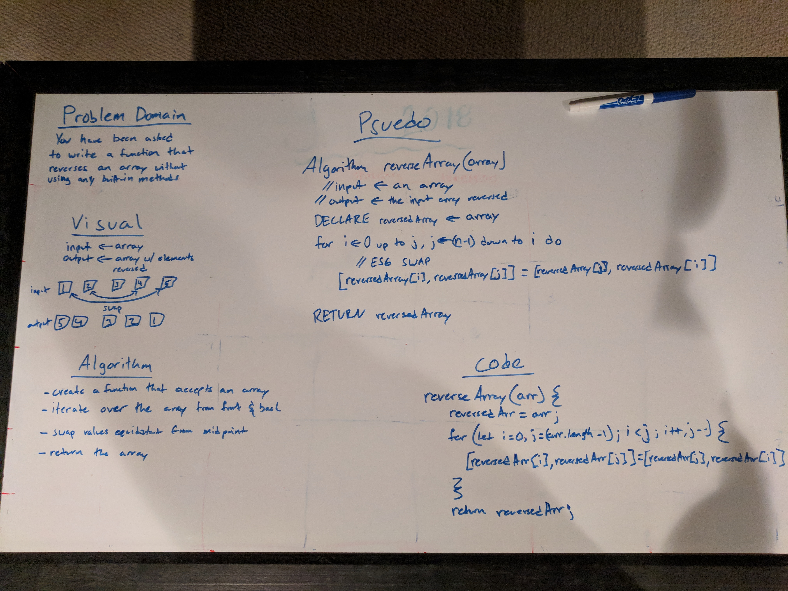
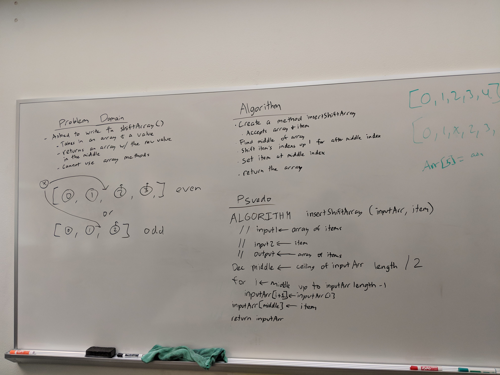
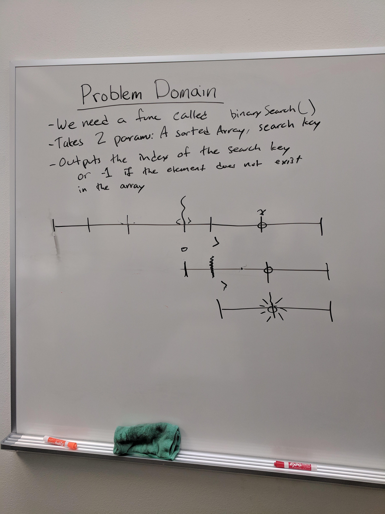

# data-structures-and-algorithms

# Reverse an Array
Algorithm to reverse an array using ES6 and without using any built-in methods

## Challenge
Write a function called `reverseArray` which takes an array as an argument. Without utilizing any of the built-in methods available to your language, return the provided array argument with elements in reversed order.

## Solution


# Insert and shift middle index of array
Shifts all items after the middle index and inserts an item into the gap

## Challenge
Write a function called `insertShiftArray` which takes in an array and the value to be added. Without utilizing any of the built-in methods available to your language, return an array with the new value added at the middle index.

## Solution


# Binary Search
Binary search in a sorted 1D array

## Challenge
Write a function called `binarySearch` which takes in 2 parameters: a sorted array and the search key. Without utilizing any of the built-in methods available to your language, return the index of the array’s element that is equal to the search key, or -1 if the element does not exist.

## Solution



# Linked List
Data structure for a singly-linked list

## Usage 
- Run `npm install` to install dependencies
- all methods besides `deserialize()` and `mergeLists()` are class methods
- `deserialize() and mergeLists()` are static methods on the LinkedList class
## Methods
- `append(value)` appends a node to the end of the linked list
- `prepend(value)` prepends a node to the begining of the linked list
- `reverse()` reverses the order of the nodes in the linked list
- `remove(offset)` removes a node from the linked list
- `serialize()` stringifies the linked list 
- `LinkedList.deserialize(serializedList)` creates a new LinkedList from a stringified linked list object
- `insertBefore(refVal, newVal)` inserts a new Node with value `newVal` before Node with `refVal`
- `insertAfter(refVal, newVal)` inserts a new Node with value `newVal` after Node with `refVal`
- `kthFromEnd(k)` returns the value of a node k-offset from the end of the list
- `mergeLists(list1, list2)` merges list 2 into list 2, alternating values with list 1 starting the head

# Stacks and Queues
 An exploration into stack and queue data structures

# Stack
### Methods
#### stack.push(val)
- pushes a value on top of the stack
- throws an error if no parameter is passed
- increases the size of the stack

#### stack.pop()
- pops the top value off a stack and returns it
```
 top
-----
| 4 |          -----
| 3 |  'pop()' | 3 |
| 2 |    ==>   | 2 |
| 1 |          | 1 |
-----          -----
bottom
```
- `stack.pop()` will return `4`
- `stack.pop()` will return undefined if the stack is empty

#### stack.peek()
- `stack.peek()` will return the top value in a stack without removing it
```
 top
-----          -----
| 4 |          | 4 |
| 3 | 'peek()' | 3 |
| 2 |   ==>    | 2 |
| 1 |          | 1 |
-----          -----
bottom
```
- `stack.peek()` will return `4`
- `stack.peek()` will return undefined for an empty stack

# Queue
### Methods
#### queue.enqueue(val)
- appends a value to the end of a queue
- throws an error if now value is passed
- increases the size of the queue

#### queue.dequeue()
- returns the element at the front of the queue
```
     ------------------
back | 4   3   2   1  | front
     ------------------
          dequeue() => 1
          -------------
    back  | 4   3   2 | front 
          -------------
```
- `queue.dequeue()` returns `1`
- `queue.dequeue()` returns undefined for an empty queue

# Trees

# Binary Search Tree
Data structure for a binary search tree

## Methods
- `insert(node)` accepts a `Node` (implemented in `node.js` file) and appends it to the tree based on binary search tree rules: lesser value appends left, greater value appends right
- `remove(node)` accepts a `Node` and removes it from the tree along with all references of it. Removing a node with two children finds the minimum node along the right sub-tree and restructures it to follow binary search tree structure
- `serialize()` serializes the tree instance
- `BinarySearchTree.deserialize(tree)` accepts a serialized tree and deserializes it
- `BinarySearchTree.fizzBuzz(tree)` accepts any tree and performs an in-order traversal to convert node values of `3` to `fizz`, `5` to `buzz`, and `15` to `fizzbuzz`
- `breadthFirstTraversal` executes a breadth first traversal of the tree and returns an array of nodes in the order they were visited
- `BinarySearchTree.findMaxBinaryTree(tree)` accepts a binary tree and returns the greatest node value

# Graphs

## Breadth First Traversal
- `breadthFirstTraversal(vertex)` accepts a vertex value and performs a breadth first traversal from that starting vertex, outputting to the console (and returning) an array of vertices in the order they were visited.

# Weighted Graph
## Methods
- `getEdge(src, dest)` accepts a source vertex and destination vertex and returns the weight of the edge between them if it exists, otherwise returns undefined
- `getEdges(vertices)` accepts an array of vertices and resolves down to an array `[hasPath, cost]` where `hasPath` is a boolean value representing whether a path exists along the given vertices and `cost` is the total cost of the weights along that path. If there is no path `getEdges(vertices)` returns `[false, $0]`
